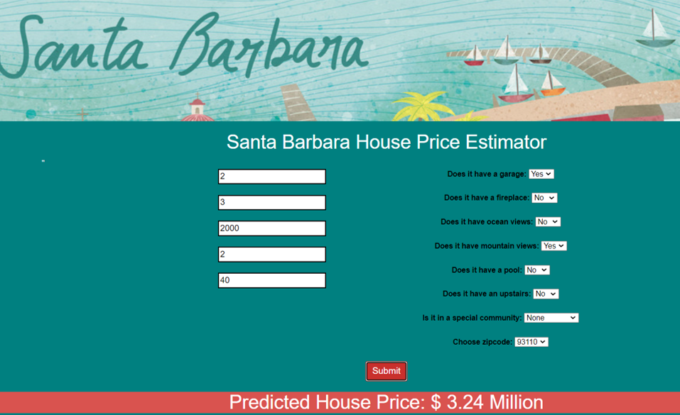

# Dakota Rawlings Personal Data Science Projects

## Overview

This repository contains my most recent personal data science projects. Here I am showcasing a few projects that show a variety of different skills including model productionalization, incorporation of models into full stack web apps, web scraping, data cleaning, feature engineering, visualization, shallow model implementation, hyper parameter tuning, model interpretation, neural network implementation, image classification, and more. 

## [1. Housing price estimator web application](/santa_barbara_realestate_analysis)

  
   
  <em>Web App Link: https://sb-house-price-estimator.herokuapp.com/</em>
   

* Built a web scraper from scratch to scrape data from ~1500 realestate sales over the past 4 years in Santa Barbara from trulia.com and created associated SQLite database
* Engineered features from house description to quantify the value of certain house attributes such as "ocean views", "pool", "fireplace", etc. 
* Optimized hyper parameters for linear, lasso, random forest, LightGBM, Catboost, and XGboost
* Built a flask API endpoint for estimating a house price based on features
* Wrote a web application in HTML, CSS, and JavaScript to call API, display price prediction based on user input
* Deployed web app on Heroku: https://sb-house-price-estimator.herokuapp.com/
## 2. Snake image classification 
* Scraped ~2000 images of native snakes in Santa Barbara from Bing.com
* Built and trained a CNN using Keras and TensorFlow to identify snake species based on images with 80% accuracy
* Built a flask API to identify snake species based on image and hosted API on Heroku
## 3. USFS forest data analysis
* Exploratory data analysis on USFS forest database (BigQuery, GCP, Google colab)

## Learn More about me

You can learn more about me at the following links

1. [LinkedIn profile](https://www.linkedin.com/in/dakotarawlings/)
2. [Google Scholar profile](https://scholar.google.com/citations?view_op=list_works&hl=en&hl=en&user=X_x46vUAAAAJ)
3. [Reseach group website](http://www.segalman.mrl.ucsb.edu/)
