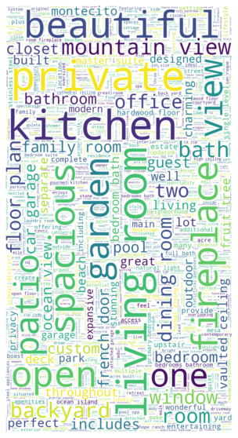

# Santa Barbara Real Estate Price Estimator

## Overview
* Built a web scraper from scratch to scrape data from ~1500 sinlge family homes that have been sold over the past 2 years in Santa Barbara from trulia.com and created SQLite database
* Engineered features from house description to quantify the value of certain house attributes such as "ocean views", "pool", "fireplace", etc. 
* Optimized hyper parameters for linear, lasso, random forest, LightGBM, Catboost, and XGboost
* Built a flask API for estimating a house price based on features and hosted API on Heroku

## Resources
**Python version:** 3.8

**Packages:** sqlite3, pandas, numpy, sklearn, Catboost, LightGBM, seaborn, requests, beautifulsoup, flask, pickle

**Flask api reference:** https://towardsdatascience.com/productionize-a-machine-learning-model-with-flask-and-heroku-8201260503d2

## Web Scraping
* Built a web scraper from scratch using python and beautiful soup to scrape data for ~1500 sinlge family homes that have been sold in the past 2 years off of trulia.com
* Extracted features from each listing such as:
  - Closing price
  - Year built
  - Lot area
  - House sqft
  - Number of bedrooms/bathrooms
  - House description
  - House address
  - Sold date
* Stored raw data in SQLite database

## Data Cleaning and Feature Engineering
* Extracted features from the house description, such as the presence of key words/phrases such as "pool", "ocean views", "mountain views", "fireplace", etc.
* Converted "year built" to house age
* Extracted the zipcode from the address as a categorical variable
* Used one hot encoding to create dummy variables for categorical variables such as the zipcode
* Used a KNN regressor to impute missing values 
* Rescaled several variables to ensure that most features had similar scales
* Normalized the distribution of several variables with skewed distributions

## Exploritory Data Analysis
Used data visualization and basic summary statistics to analyze the distribution of variables, correlation between variables, outliers, data range, and more

## Model Development
* I split the data into train and test sets (20% test) with the price as the target variable
* Due to the sparse nature of the dataset, I tried to choose models that work well with sparse data including normalized regression such as lasso, and tree based models. I evaluated the performance of 7 different models including:
  - Linear regression 
  - Lasso regression 
  - Support vector regression
  - Random forest
  - XGBoost
  - LightGBM
  - Catboost
* Used GridsearchCV to tune the hyperparameters of each model (when appropriate)
* Evaluated the performance of each model using 3 fold cross validation
* After comparing the MAE of each optimized model, the LightGBM model outperformed the other models 

## Model performance
The LightGBM model achieved an MAE of $0.42 million (about 15% of the mean price)

## Model Productionalization
